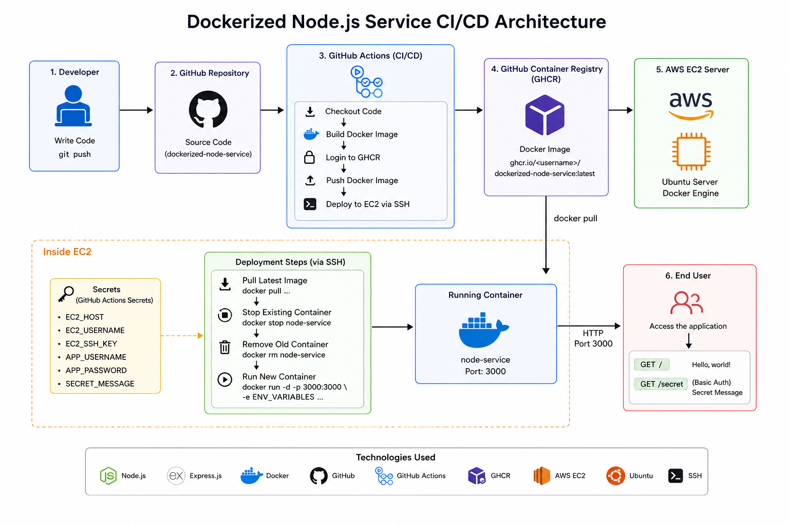

# 🚀 Dockerized Node.js Service

A simple Node.js service containerized with Docker and automatically deployed to an AWS EC2 server using GitHub Actions.

This project demonstrates a complete CI/CD pipeline including Dockerization, container image management, remote deployment, and secrets management.

---

## 🏗️ Project Architecture

The application follows a simple CI/CD architecture where code changes are automatically built, containerized, pushed to GitHub Container Registry, and deployed to an AWS EC2 server.



### 🔄 Deployment Flow

```text
Developer
    │
    │ git push
    ▼
GitHub Repository
    │
    ▼
GitHub Actions
    │
    ├── Checkout Code
    ├── Build Docker Image
    ├── Push Image to GHCR
    └── Deploy via SSH
             │
             ▼
        AWS EC2
             │
             ├── Docker Pull
             ├── Stop Old Container
             ├── Remove Old Container
             └── Run New Container
                     │
                     ▼
                Node.js App
                   :3000📸 CI/CD Workflow

The GitHub Actions workflow automatically builds and deploys the application whenever changes are pushed to the main branch.

📌 Project Overview

The goal of this project is to:

Create a simple Node.js service
Dockerize the application
Push the Docker image to GitHub Container Registry
Deploy the container to a remote AWS EC2 server
Automate deployment using GitHub Actions
Manage sensitive information using GitHub Secrets

The application provides two endpoints:

Endpoint	Description
/	Returns Hello, world!
/secret	Protected using Basic Authentication
🛠️ Technologies Used
Node.js
Express.js
Docker
Docker Compose
Git
GitHub
GitHub Actions
GitHub Container Registry (GHCR)
AWS EC2
Ubuntu Linux
SSH
Environment Variables
Basic Authentication
📂 Project Structure
dockerized-node-service/
│
├── .github/
│   └── workflows/
│       └── deploy.yml
│
├── assets/
│   ├── architecture.jpg
│   └── github-actions.jpg
│
├── .dockerignore
├── .gitignore
├── Dockerfile
├── app.js
├── package.json
├── package-lock.json
└── README.md

Sensitive files such as .env, SSH private keys, and other credentials are excluded from the repository.

🧩 Application
⚙️ Environment Variables

The application uses environment variables for configuration.

Create a .env file locally:

SECRET_MESSAGE=Welcome to my secret service!
USERNAME=admin
PASSWORD=your-password

The .env file is intentionally excluded from Git and Docker images.

📦 Install Dependencies
npm install
▶️ Run Locally

Start the application:

node app.js

The application listens on:

http://localhost:3000

Test the public endpoint:

curl http://localhost:3000/

Expected response:

Hello, world!
🔐 Protected Endpoint

The /secret endpoint is protected using Basic Authentication.

curl -u "admin:your-password" \
http://localhost:3000/secret

The endpoint returns the configured secret message when valid credentials are provided.

Invalid credentials return:

401 Unauthorized
🐳 Dockerization
Build Docker Image
docker build -t dockerized-node-service:1.0 .

Verify the image:

docker images
Run Docker Container
docker run -d \
  --name node-service \
  -p 3000:3000 \
  --env-file .env \
  dockerized-node-service:1.0

Check the running container:

docker ps

Test the application:

curl http://localhost:3000/
🔒 Security

Sensitive information is never committed to the repository.

The following files are excluded using .gitignore:

.env
*.pem
pass_var.sh
node_modules/

Application secrets are passed to the container at runtime using environment variables.

For CI/CD deployment, sensitive values are stored securely using GitHub Actions Secrets.

☁️ AWS EC2 Deployment

The application is deployed to a remote Ubuntu EC2 instance running Docker.

EC2 Environment
Ubuntu Linux
Docker Engine
Docker Compose
SSH
Port 3000

The deployed application can be accessed through:

http://<EC2_PUBLIC_IP>:3000
🔄 CI/CD Pipeline

The deployment pipeline is triggered automatically whenever code is pushed to the main branch.

Pipeline Steps
1. Checkout Repository
          ↓
2. Build Docker Image
          ↓
3. Login to GHCR
          ↓
4. Push Docker Image
          ↓
5. SSH into AWS EC2
          ↓
6. Pull Latest Docker Image
          ↓
7. Stop Existing Container
          ↓
8. Remove Existing Container
          ↓
9. Run New Container

This creates an automated build and deployment process without manually deploying the application to the server.

📦 GitHub Container Registry

Docker images are published to GitHub Container Registry.

Image format:

ghcr.io/<github-username>/dockerized-node-service:latest

During deployment, the EC2 server pulls the latest image from GHCR.

🔑 GitHub Actions Secrets

The following secrets are configured in the repository:

Secret	Purpose
EC2_HOST	EC2 public IP address
EC2_USERNAME	SSH username
EC2_SSH_KEY	SSH private key
APP_USERNAME	Basic Auth username
APP_PASSWORD	Basic Auth password
SECRET_MESSAGE	Secret message

Secret values are never stored directly in the source code.

🧪 Testing
Public Endpoint
curl http://<EC2_PUBLIC_IP>:3000/

Expected:

Hello, world!
Protected Endpoint
curl -u "USERNAME:PASSWORD" \
http://<EC2_PUBLIC_IP>:3000/secret
Invalid Credentials
curl -u "wrong:wrong" \
http://<EC2_PUBLIC_IP>:3000/secret

Expected:

401 Unauthorized
📊 Project Results

The project successfully demonstrates:

✅ Node.js application development
✅ Express.js REST endpoints
✅ Basic Authentication
✅ Docker image creation
✅ Docker container deployment
✅ Environment-based configuration
✅ GitHub repository management
✅ GitHub Actions CI/CD
✅ GitHub Container Registry
✅ AWS EC2 deployment
✅ SSH-based remote deployment
✅ GitHub Secrets management
🚀 Future Improvements

Possible improvements include:

 Add automated unit tests
 Add Docker image versioning using Git commit SHA
 Add application health checks
 Add Nginx reverse proxy
 Add HTTPS using Let's Encrypt
 Add AWS CloudWatch monitoring
 Use Amazon ECR instead of GHCR
 Provision infrastructure using Terraform
 Implement blue/green deployment
 Add Docker image security scanning
 Add deployment rollback strategy
👩‍💻 Author

Shahd Ahmed

Junior DevOps & Cloud Engineer | AWS

GitHub:
https://github.com/shahdahmed123

⭐ If you found this project useful, feel free to give it a star!


## 🔥 

